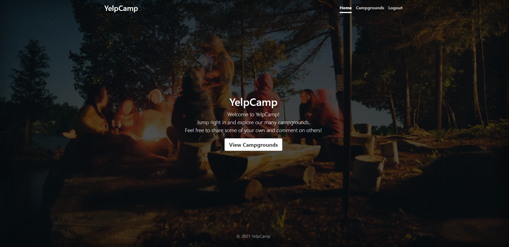
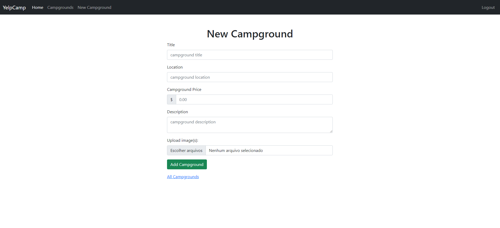
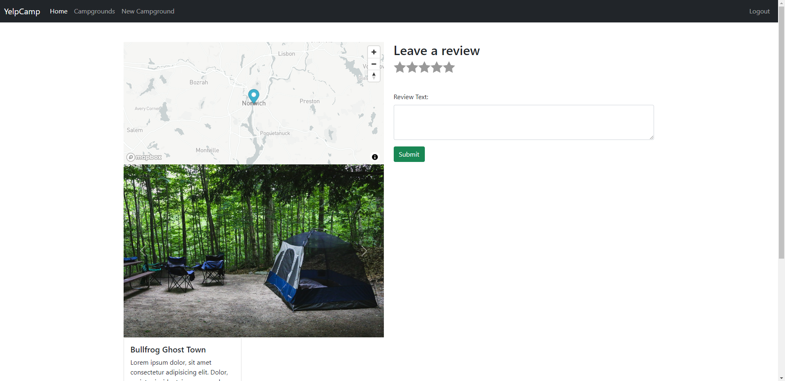
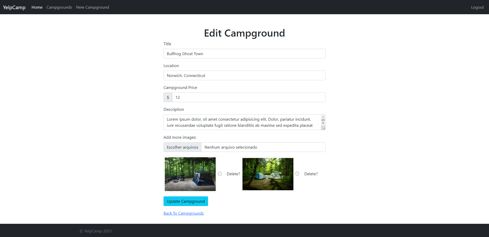
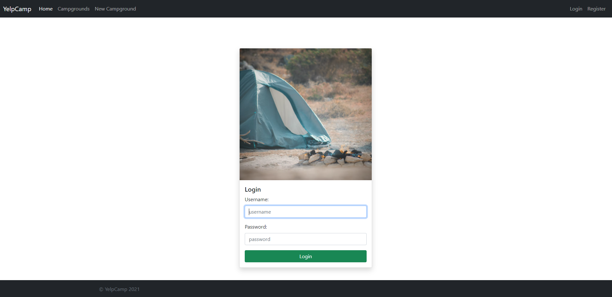
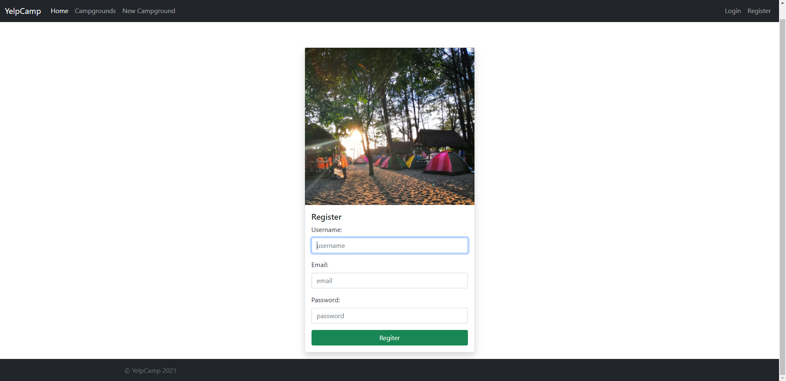

# YelpCamp

YelpCamp is my web development major project. It is a platform where users can find campgrounds, post commentaries and rate each campground. Also, there is the possibility for the user to add a new campground owned/managed by him/her.

If you wish to check out this project, it is deployed in heroku, under the address: https://bit.ly/3o4uvrc

The website has 7 pages, which are:

- Home
- Campgrounds
- New campground
- Specific campground (identified by its ID)
- Edit campground
- Login
- Register

In the following sections, a more detailed explanation is given for each of those pages.

## Home

The home page is pretty simple. It has a title and a short text, with a top navigation bar and a background image. With the navigation bar, the visitor can access the Campgrounds, the Login and the Register pages.

## Campgrounds

On the campgrounds page, one can see all available campgrounds, which are also displayed in a cluster map. When the map is zoomed in enough, the clusters becomes a single point. When clicked, it shows up the campground name with a link to its page.

In the navigation bar, there is also a link to go to the new campground page, where is possible to add new campgrounds. This page is available only for the users that have signed in.

## New campground

On the new campground page, which is available only for singed in users, the user can add a new campground to the database. In order to accomplish that, it required a title, location, price, description and pictures of the campground. The rules for each field are: string for the title, location and description field, a number for the price field, and jpg or png pictures are allowed to be uploaded.

## Specific campground

On the a specific campground page, information of that campground are shown (the same information entered when added) as well as a map pointing its location. On this page, any user can rate and comment about the campground. Furthermore, through this page the user who added the campground can delete or edit it.

## Edit campground

On the edit campground page it is possible to edit information about that specific campground. It is accessible only for the user who added the campground. The input rules of each field is the same of the new campground page.

## Login

On the login page, the user can login yo his/her account by entering the username and password.

## Register

On the register page, the visitor can sign up to YelpCamp. It is required a username (string), email (string with email format) and password (string).

## Tools

Here are listed the tools used to develop this project, programmed using CSS, HTML and JavaScript. They comprise REPL, prompt, libraries, packages, middlewares, APIs and services.

- Node.js
- Nodemon
- Express
- Express-section
- Express-mongo-sanitize
- Connect-flash
- MongoDB
- Mongoose
- Bootstrap
- JOI
- EJS
- EJS-mate
- Passport
- Passport-local
- Passport-local-mongoose
- Starability CSS
- Multer
- Cloudinary
- Dotenv
- Mapbox
- Sanitize-html
- Helmet
- Connect-mongo
- Heroku
- Mongo Atlas
